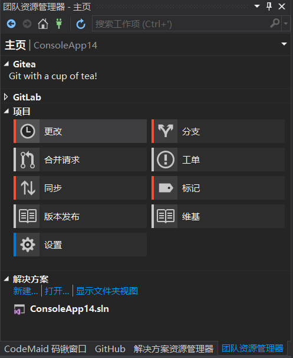
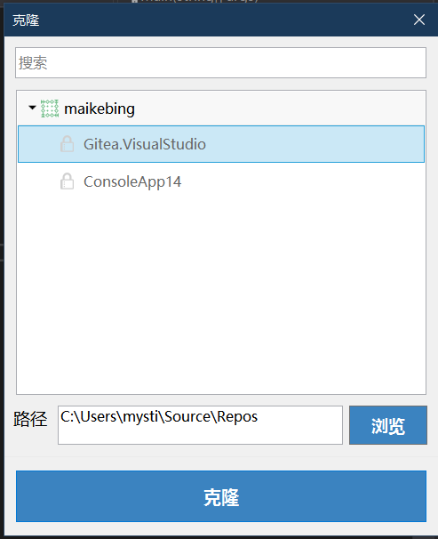

# Gitea  Extension for Visual Studio

You can log any of your favorite Gitea servers and start your great job!

The Gitea Extension for Visual Studio provides Gitea integration in Visual Studio 2015/2017.
Most of the extension UI lives in the Team Explorer pane, which is available from the View menu.

Appveyor:

The Visual Studio Extension is also available at the [Visual Studio Marketplace](https://marketplace.visualstudio.com/items?itemName=MysticBoy.GiteaExtensionforVisualStudio), or by searching for Gitea4VS  in the Visual Studio extension manager.
The latest build of the Visual Studio Extension is available at the [Open VsixGallery](http://vsixgallery.com/extension/62991164-1F3E-4AAA-BF2F-537C83AF987C/)

## What's new ?

#### V1.0.24

* Added option to create or publish to organizations.
* Added Connect and Sign Up buttons to ConnectSectionView.xaml and now leaving visible.
* Removed password from .Gitea file and pull it from the Credential Manager.
* Now storing last path cloned to in the .Gitea file.
* Some bug fixes.
   
    Thanks [!troygeiger](https://github.com/troygeiger)

 
### HomePage
  https://visualstudio.giteahub.com/

### BUG And Issues
 
https://github.com/maikebing/Gitea.VisualStudio/issues

###    Visual Studio    |   Marketplace
https://marketplace.visualstudio.com/items?itemName=MysticBoy.GiteaExtensionforVisualStudio

### Thanks
 
####  GitHub Extension for Visual Studio
  
####  CodeCloud Extension for  Visual Studio

####  GitLab Extension for  Visual Studio

#### Visual Studio Extension for opening files on GitHub.com
https://github.com/neuecc/Open-on-GitHub 

#### gitea.net
 https://github.com/mkloubert/gitea.net

### Screenshots

 

